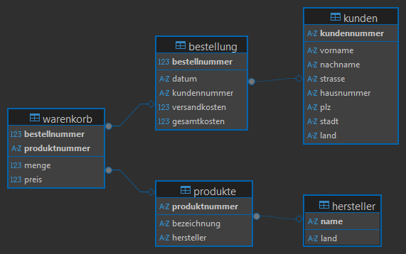

# Assignment 2 - Create ERD from Connected Tables


## 1. Create a SQLite Database from .cvs-files in aufgabe1
### Linux/UNIX

```
sh create_db.sh | sqlite3
```

### Windows

Open Powershell and run git's *bash*

```
bash create_db.sh | C:\sqlite3\sqlite3.exe
```

## 2. Create ERD with DBeaver

1. Install [DBeaver](https://dbeaver.io/)
2. Connect the created `online_shop.db` in *DBeaver* via *Database* -> *new connection*
3. Create the ERD from the database navigator



